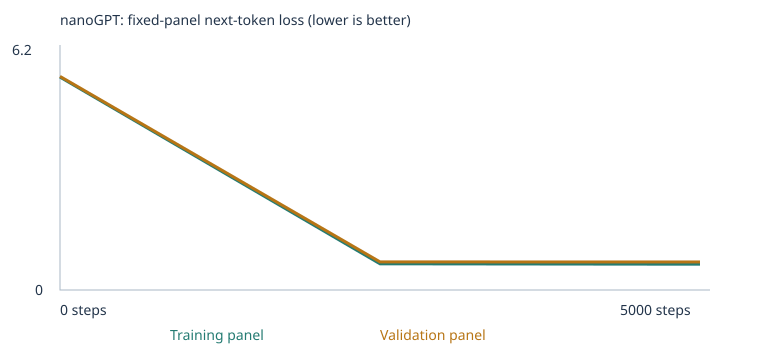
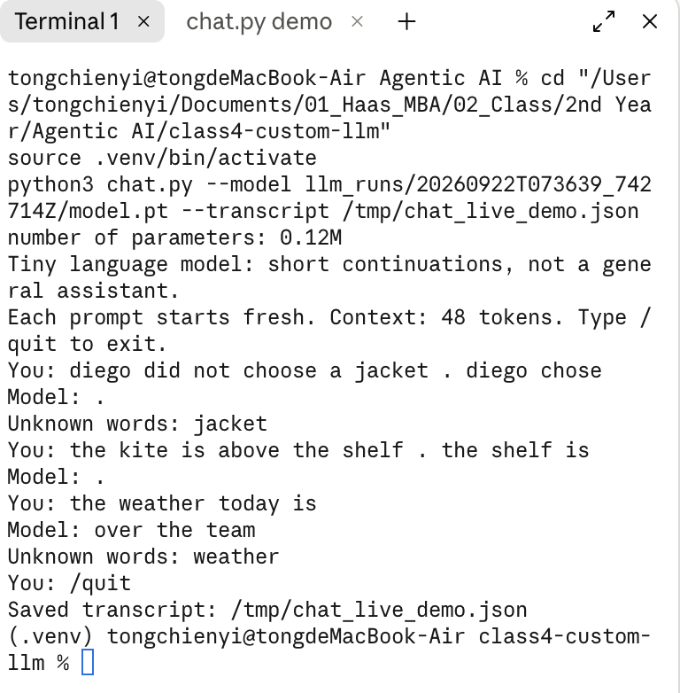

# My Custom LLM Experiment

Irene Tong — Class 4, Building a Custom LLM

Grading uses deliverable quality **4 points**, testing & evaluation **3 points**,
and working result **3 points**. Your model's eval percentage is not your grade.
Complete, valid eval evidence and a reasoned comparison matter; no minimum pass
rate or numerical improvement is required. Missing evidence earns less credit.

Two executed notebooks are in this repo:
- [`experiment1_starter.ipynb`](experiment1_starter.ipynb) — starter (classroom) corpus only
- [`experiment2_expanded.ipynb`](experiment2_expanded.ipynb) — starter + negation + spatial-relations extension

## My choices and prediction

**Corpus:** `CORPUS = "classroom"` in both experiments (the built-in classroom teaching
sentences). Experiment 2 additionally adds two files I wrote myself to `corpus/`:
[`negation.txt`](corpus/negation.txt) (40 sentences) and
[`spatial_relations.txt`](corpus/spatial_relations.txt) (49 sentences). No PDFs were
used, so there is no OCR/extraction step to check — both files are plain UTF-8 `.txt`,
written directly in the pattern style the classroom corpus uses (lowercase, spaced
punctuation).

**Training steps:** 10 first, as a setup/timing sanity check (confirmed the full
pipeline — corpus load, tokenize, train, evals before/after, save — runs correctly and
takes only a few seconds on this machine), then **5,000** for both real experiments.
3,000 is the assignment's suggested starting budget; I went slightly higher because the
tiny model trains so fast locally (5,000 steps took ~16 seconds either way) that the
extra budget cost nothing, and I wanted training loss to fully plateau before comparing
the two corpora.

**Learning rate:** kept the default **0.001**, with the notebook's built-in warmup +
cosine decay. Reasoning: too large a learning rate risks the Adam update overshooting
and destabilizing the already-small 64-dim embedding space (visible as loss spikes or
divergence); too small means 5,000 steps would not be enough to move the randomly
initialized weights far from their starting point, and the samples would stay close to
noise. 0.001 is the notebook-recommended default for this model size and was not tuned
further, since the goal here is to understand the pipeline, not to hill-climb the eval score.

**Prediction, written before training** (verbatim, from each notebook's "My prediction" cell):

> **Experiment 1** — I expect training loss to fall quickly over the first few hundred
> steps (the classroom corpus is small and highly templated), then flatten at a low
> value. Samples should move from word-salad to recognizable domain co-occurrences
> ("customer" → "service"/"purchase", "mortgage" → "payment"). On the 48-case suite I
> expect solid `starter_patterns` results, weaker/mixed `starter_transfer`, and close
> to 0/24 on `extend_corpus`, since the classroom corpus never uses negation, spatial,
> grammar, or the other extension vocabulary — most of those cases should come back
> `out_of_vocabulary` rather than simply wrong.
>
> **Experiment 2** — Same base behavior expected, plus measurably better
> `negation`/`spatial_relations` category scores than Experiment 1's near-zero, since
> the exact vocabulary ("not", "never", "above", "below", "inside", "contains", "left",
> "right", "between") and sentence shapes now appear in training. I don't expect a
> clean sweep since 89 new lines is small next to the corpus's dominant classroom
> sentences, and I expect no change on the other six `extend_corpus` categories, since I
> added no data for those.

Extension category choice: I chose **negation** and **spatial relations** because they
are two of the eight `extend_corpus` skills the starter corpus has zero coverage for,
they're easy to generate large amounts of varied, unambiguous synthetic data for, and
together they let me test two different failure modes — a *linguistic* pattern
(negate-then-correct) versus a *relational* one (inverse spatial prepositions).

Unique passages added: `negation.txt` contributed **120** post-chunking passages,
`spatial_relations.txt` contributed **94** (each of my lines can contain 1–3 clauses,
and the loader's `chunk_text` splits at every sentence-ending period — see
[corpus_manifest.json](llm_runs/20260922T073639_742714Z/corpus_manifest.json), which
also shows zero warnings and zero ignored files).

## My run

| | Experiment 1 — starter | Experiment 2 — starter + negation + spatial |
|---|---|---|
| Notebook | [experiment1_starter.ipynb](experiment1_starter.ipynb) | [experiment2_expanded.ipynb](experiment2_expanded.ipynb) |
| Run folder | [llm_runs/20260922T073557_880181Z/](llm_runs/20260922T073557_880181Z/) | [llm_runs/20260922T073639_742714Z/](llm_runs/20260922T073639_742714Z/) |
| Completed steps | 5,000 (not interrupted) | 5,000 (not interrupted) |
| Elapsed time | 16.08 s | 16.05 s |
| Parameters | 111,872 | 120,768 |
| Vocabulary size | 136 (133 learned + 3 special tokens) | 275 (272 learned + 3 special tokens) |
| Train / validation documents | 4,132 / 460 | 4,319 / 480 |
| Training / held-out unknown-token rate | 0.0% / 0.0% | 0.0% / 0.037% |

**Hardware:** this ran **locally on my Mac** (`macOS-15.3-arm64-arm-64bit`, CPU only,
PyTorch 2.8.0, Python 3.9.6) — not Google Colab. I originally planned to use Colab, but
switched to running everything locally via a Python venv and `jupyter nbconvert
--execute` so I could iterate and verify results directly; the model is tiny enough
(2 blocks, 4 heads, 64-dim, 48-token context) that both 5,000-step runs completed in
about 16 seconds each on CPU. All settings (`config.json`) and full logs
([training.csv](llm_runs/20260922T073639_742714Z/training.csv),
[training_summary.json](llm_runs/20260922T073639_742714Z/training_summary.json)) are
linked per run above.

Held-out unknown-token rates were ~0%, meaning the 509-token cap wasn't even reached
(133 and 272 distinct types respectively) — every word I actually used in training,
including my new negation/spatial vocabulary, made it into the vocabulary. This matters
for interpreting the eval results below: **coverage was not limited by the 509-token
cap**, it was limited by which *specific* words I chose to write with (see "One
limitation" below). The split is by deduplicated short passage, not source file, so it
tests whether the model generalizes to new specific *sentences*, not to unseen sources
or topics — most held-out passages still reuse the same sentence templates as training.

## My evidence

**Training curves** (fixed panels of ≤20 training / ≤20 validation documents,
mean loss over non-padding next-token targets):

Experiment 1:


| Step | Training loss | Validation loss |
|---|---|---|
| 0 | 4.9263 | 4.9275 |
| 2500 | 0.6796 | 0.6984 |
| 5000 | 0.6713 | 0.7011 |

Experiment 2:


| Step | Training loss | Validation loss |
|---|---|---|
| 0 | 5.6439 | 5.6626 |
| 2500 | 0.6955 | 0.7436 |
| 5000 | 0.6846 | 0.7422 |

Full history: [history.json (exp 1)](llm_runs/20260922T073557_880181Z/history.json),
[history.json (exp 2)](llm_runs/20260922T073639_742714Z/history.json). Both curves drop
sharply in the first half of training then flatten — expected for a small, highly
repetitive/templated corpus. Experiment 2 starts at a higher loss (more distinct
vocabulary to place in the fixed 64-dim embedding table initially) but converges to a
similar validation loss, and validation tracks training closely in both, consistent
with the held-out split reusing the same sentence templates rather than testing novel
content.

**Untrained → halfway → final samples** (same prefix-free sampling settings each time;
full timelines linked):

*Experiment 1* ([samples/](llm_runs/20260922T073557_880181Z/samples/)):
- **Untrained:** `pear professor bond doctor course harvest team physician journey checking buyer delivery traffic report the lecturer item offering and system <UNK> taste recommended mentioned bus question customer at mortgage nurse in instructor` — pure word salad, as expected from random embeddings.
- **Halfway (step 2500):** `the report about the car explains the journey in detail .` — already grammatical and matches a real classroom template.
- **Final (step 5000):** `our school has a question about the new educator and lesson .` — fluent, on-template, and combines domain words the "right" way.

*Experiment 2* ([samples/](llm_runs/20260922T073639_742714Z/samples/)):
- **Untrained:** `student at plate sits not . smooth helped under grapes stew delivery right it patient never product plant tokyo question between <UNK> today bicycle oscar train did juice security merchandise sits sink` — also word salad, but visibly contains my new vocabulary (`sits`, `not`, `between`, `right`, `never`) mixed in with classroom words, since the embedding table now covers both.
- **Halfway (step 2500):** `we learned about the local merchandise during a discussion of delivery .`
- **Final (step 5000):** `our market has a question about the new offering and design .`

Both experiments visibly learn the *classroom* templates well; neither final sample
happens to land on a negation/spatial sentence (generation starts from a random
held-out prefix, and the classroom corpus is ~30x larger than my extension, so most
draws land on classroom-style text) — this is exactly why I test the extension pattern
directly via chat prompts below rather than relying on unprompted samples.

**Token → ID → embedding, one word traced through training** (from
[tokenization.json](llm_runs/20260922T073639_742714Z/tokenization.json) and
[inspection.json](llm_runs/20260922T073639_742714Z/inspection.json), Experiment 2):

- Example passage: `"we learned about the new apple during a discussion of juice ."`
- Token IDs: `[1, 265, 120, 5, 238, 143, 10, 76, 4, 70, 148, 113, 3, 2]` (1=`<BOS>`, 2=`<EOS>`)
- Inspected word: **`customer`**, token ID **58**
- `embedding_before` (first 5 of 64 numbers): `[0.00732, 0.01845, 0.00340, 0.02862, -0.03831, ...]` — small random values (Xavier-style init)
- `embedding_after` (first 5 of 64 numbers): `[-0.00126, 0.16751, 0.03136, 0.04062, -0.02702, ...]` — the 2nd coordinate moved from 0.018 to 0.168, a large, non-random shift specific to this dimension

**Next-token probability, same prefix "the customer"** (275-way softmax over the vocabulary):

| Rank | Before training | Prob | After training | Prob |
|---|---|---|---|---|
| 1 | `customer` | 0.0091 | `returned` | 0.2002 |
| 2 | `final` | 0.0055 | `compared` | 0.1970 |
| 3 | `race` | 0.0055 | `reviewed` | 0.1645 |
| 4 | `offering` | 0.0054 | `visited`→`recommended` | 0.1556 |
| 5 | — | — | `ordered` | 0.1481 |

Before training, probabilities are near-uniform (1/275 ≈ 0.0036) — no real preference.
After training, the top 5 words are *exactly* the six verbs the classroom corpus uses in
its `"the {noun} {verb} the {product} after checking the price ."` template
(ordered/reviewed/compared/returned/recommended/selected), together carrying ~87% of
the probability mass — the model learned the plausible-continuation set precisely.

**One real gradient + parameter update** (`first_update` in
[inspection.json](llm_runs/20260922T073639_742714Z/inspection.json)):

- Parameter: the embedding table's `customer` row, coordinate 0
- Before: `0.007320104632526636`
- Gradient: `-0.002491062507033348`
- Effective learning rate at this (warmed-up) step: `1e-05`
- After: `0.007330103777348995`

The actual change (`+0.00001000`) is close in *magnitude* to the learning rate itself
(`1e-05`) rather than to `lr × gradient` (`≈ +2.5e-8` under plain SGD) — that's AdamW's
adaptive normalization: it rescales each parameter's update by its own running
gradient-magnitude estimate, so early updates move roughly `±lr` regardless of the raw
gradient's scale. This is also why the learning rate is `1e-05` and not `0.001` here —
it's step 1 of the notebook's linear warmup schedule, not the full learning rate.

**Temperature comparison** (same seed/prefix, 3 temperatures — see
[temperature_comparison.json](llm_runs/20260922T073639_742714Z/temperature_comparison.json)):

| Temperature | Sample |
|---|---|
| 0.3 (sharper) | "the team discussed the loan and the return at the bank ." |
| 0.8 (default) | "our kitchen has a question about the different orange and juice ." |
| 1.2 (flatter) | "student cooked" (a rarer, less template-perfect continuation) |

Lower temperature divides the logits by a smaller number before the softmax, sharpening
the distribution toward the highest-probability (safest, most template-typical) tokens;
higher temperature flattens it, letting lower-probability tokens get sampled — visible
above as the 1.2 sample breaking from the exact classroom template. **No weights change
between temperatures** — this is purely a sampling-time transformation of the same
fixed final logits, done at generation time only.

## My fixed language evals

Eval suite: [`evals/language_evals.json`](evals/language_evals.json) (unchanged,
48 cases, sha256 `1d7c503f...c9e1d`), scored with [`run_evals.py`](run_evals.py) inside
the notebook's sections 6b (before training) and 8b (after training). Scoring rule: the
model ranks four single-word choices by next-token probability; the highest-probability
choice wins (ties score 0); unknown-vocabulary or overlong prompts are marked
`out_of_vocabulary`/`context_too_long` and score 0 in the all-case metric, separate from
`scorable accuracy` (which only divides by cases with usable vocabulary/context). A
free-text continuation is generated and saved for every case too — it is *not* the
scored answer, just additional evidence of what the model actually produces.

| Experiment | Stage | Correct / 48 | Scorable / 48 | Accuracy among scorable cases | Full results |
|---|---|---|---|---|---|
| Starter corpus | Untrained | 9 | 24 | 37.5% | [untrained/](llm_runs/20260922T073557_880181Z/language_evals/untrained/) |
| Starter corpus | Trained | 22 | 24 | 91.7% | [final/](llm_runs/20260922T073557_880181Z/language_evals/final/) |
| Expanded corpus | Untrained | 8 | 24 | 33.3% | [untrained/](llm_runs/20260922T073639_742714Z/language_evals/untrained/) |
| Expanded corpus | Trained | 23 | 24 | 95.8% | [final/](llm_runs/20260922T073639_742714Z/language_evals/final/) |

Each `.../untrained/` and `.../final/` folder contains `eval_cases.json`,
`eval_results.json`, `eval_results.csv`, and `eval_summary.json` — all 48 cases, every
run, not just the summary above.

**By group, trained models:**

| Group | Starter (trained) | Expanded (trained) |
|---|---|---|
| `starter_patterns` (16 cases) | 16/16 | 16/16 |
| `starter_transfer` (8 cases) | 6/8 | 7/8 |
| `extend_corpus` (24 cases) | 0/24, 0 scorable | 0/24, 0 scorable |

**By category, `extend_corpus`, trained models (identical in both experiments):**

| Category | Starter | Expanded |
|---|---|---|
| grammar, opposites, reference, sequence, everyday_knowledge, categories_and_analogies (3 each) | 0/3, unscorable | 0/3, unscorable |
| **negation** (3) | 0/3, unscorable | 0/3, unscorable |
| **spatial_relations** (3) | 0/3, unscorable | 0/3, unscorable |

**Which starter patterns worked?** All 16 `starter_patterns` cases (the domain
co-occurrence and domain-place associations) scored correctly in both trained models —
the reserved test prefixes are withheld from training
([eval_separation.json](llm_runs/20260922T073639_742714Z/eval_separation.json) shows
160 excluded classroom passages, IDs `lang_01`–`lang_16`), but enough other sentences
teaching the same noun–context association remain that the model still learns it.
`starter_transfer` (new word order, same vocabulary) did slightly better in Experiment 2
(7/8 vs 6/8) — likely noise from a single extra case flipping, not a meaningful effect
of the added corpus, since neither experiment's extra data touches that vocabulary.

**Did the extension help negation/spatial_relations?** No — both stayed **0/3,
0 scorable, in both experiments.** I dug into why (see "One limitation" below): it is
**not** a training-step or vocabulary-cap issue (training/held-out unknown-token rates
were ~0%, and words like "jacket", "diego", "above", "below", "kite", "shelf" are all
present in the trained vocabulary). It's that the eval's specific negation/spatial cases
(`lang_31`–`33`, `lang_40`–`42`) use nouns and adjectives I never used — `box`, `red`,
`blue`, `green`, `yellow`, `open`, `closed`, `missing`, `desk`, `ball`, `north`,
`south`, `ava`, `tea`, `milk`, `rice`, `bread` — none of which appear anywhere in my
corpus, by design, to keep the eval suite's exact vocabulary out of training. So those
6 cases are marked `out_of_vocabulary` regardless of whether the underlying *pattern*
was learned. The chat transcript below tests the pattern directly, in-vocabulary,
instead.

**Corpus separation:** `reject_eval_leakage()` (imported from `run_evals.py`) was run
against both `negation.txt` and `spatial_relations.txt` before they ever touched
training, and again automatically against the full assembled corpus at notebook
run-time — zero matches both times. `reserve_classroom_passages()` additionally
withholds any classroom-generated sentence containing a reserved eval prefix before the
train/validation split (160 passages excluded, see `eval_separation.json` above). The
main limitation of this check: it's an *exact, normalized substring match* against the
eval `prompt` field only — it would not catch a paraphrase, and it doesn't check
against the eval `answer`/`reason` text at all, so it's a leakage floor, not a guarantee
of semantic independence. These are public, unchanged, development-benchmark tests, not
an untouched final holdout — my corpus choices were informed by knowing which 8 skill
categories the suite tests, just not by the suite's specific wording.

## My chat interface

Two ways to run it, both against the same trained Experiment 2 model
(`llm_runs/20260922T073639_742714Z/model.pt`, 5,000 completed steps, sha256
`7e6148fc...c77542`):

**1. Notebook (primary evidence):** open
[`experiment2_expanded.ipynb`](experiment2_expanded.ipynb) section 10 — it contains
three consecutive chat cells (I duplicated the section-10 cell with three different
`CHAT_PROMPT` values before running the notebook), so the executed notebook itself
shows all three real "You: ... / Model: ..." exchanges, and every turn is saved to
[`chat_transcript.json`](llm_runs/20260922T073639_742714Z/chat_transcript.json).

**2. Terminal (bonus, same model):**
```bash
source .venv/bin/activate
python3 chat.py --model llm_runs/20260922T073639_742714Z/model.pt --transcript path/to/new_transcript.json
```
Type a prompt, see a reply, type `/quit` to stop. I ran this live and interactively in
a terminal (same model, same three prompts, same deterministic per-turn seeds — so the
replies are identical to the notebook's) and saved the session to
[`chat_transcript_terminal.json`](llm_runs/20260922T073639_742714Z/chat_transcript_terminal.json):



**Three real interactions** (from `chat_transcript.json`, temperature 0.8, 24-token max,
fresh 48-token context per prompt — no memory between turns):

| # | Prompt | Reply | Notes |
|---|---|---|---|
| 1 | `diego did not choose a jacket . diego chose` | `.` | `jacket` is flagged unknown for *this* generation even though it's in the trained vocabulary — the one training passage containing it landed in the held-out 10% validation split, so the model never actually trained on it. Real limitation, not a bug. |
| 2 | `the kite is above the shelf . the shelf is` | `.` | Every word here **is** in-vocabulary with 0% training-unknown-rate, yet the model does not complete it with "below" — it was never trained on a single document containing both halves of an inverted-relation sentence (the corpus loader splits at each period; see "One limitation"), and 94 new passages is small next to ~4,800 dominant classroom passages. |
| 3 | `the weather today is` | `over the team` | `weather` is genuinely out-of-vocabulary (never appears in either corpus) — the model still generates *something* fluent-sounding from its classroom-trained distribution, illustrating that this is a narrow pattern-completion engine, not a knowledge source. |

This is a **tiny language model**: it continues text rather than answering questions,
has a hard 48-token context window (longer prompts are truncated to the most recent
tokens, flagged as `prompt_truncated`), shows unknown input words explicitly rather than
guessing, and starts completely fresh on every single prompt (no conversation memory).
Replies come only from the locally trained nanoGPT weights above — no external API, no
canned text.

## What I learned

**1. What is my corpus, what can it teach, and what is missing? Why hold data out?**
My corpus is ~4,800–5,000 short synthetic sentences: mostly templated classroom
sentences about 8 business/life domains (customers, products, loans, fruit, vehicles,
software, medicine, teaching), plus (Experiment 2) 214 new sentences teaching two
patterns — negate-then-correct, and inverse spatial relations. It can teach surface
co-occurrence and sentence-template statistics for exactly the words it contains; it
cannot teach anything about words or situations outside that vocabulary, and it cannot
prove general language understanding, since the held-out split reuses the same
templates as training. Data is held out so validation loss and samples reflect
generalization to *unseen specific sentences*, not memorization of the exact training
passages — without that split I'd have no way to tell overfitting from real learning.

**2. How do a token, token ID, vector, and embedding differ?** A *token* is a word or
punctuation mark produced by the whole-word tokenizer (`word_tokens()`). A *token ID* is
that token's integer index into the fixed vocabulary list (e.g. `customer` → `58`). A
*vector* is any list of numbers; an *embedding* is specifically the 64-number vector the
network looks up for a given token ID in its learned embedding table — it starts as
small random numbers and is nudged by gradient descent every time that token appears in
a training batch. Traced above: `customer` → ID `58` → a 64-dim vector that moved
measurably (e.g. `0.018 → 0.168` on one coordinate) over training.

**3. What makes this a neural network? How did loss, gradients, and the optimizer
change its weights?** It's layers of matrix multiplications and nonlinearities (an
embedding table, two transformer blocks with attention + feed-forward layers, and an
output projection) whose weights are learned rather than programmed. Each step: the
model predicts a probability distribution over the next token for every position in a
batch; **loss** (cross-entropy) measures how far those predictions are from the actual
next tokens; **backpropagation** computes the **gradient** of that loss with respect to
every weight (how much nudging each weight would change the loss); **AdamW** (the
optimizer) uses that gradient, plus running estimates of its mean and variance, to
compute a bounded, adaptively-scaled **weight update** — shown concretely above, where a
gradient of `-0.00249` produced an update of about `+0.00001`, roughly the size of the
learning rate itself rather than proportional to the raw gradient.

**4. What does attention combine, and why can it not look at future tokens?** Attention
lets each token position build a weighted combination of the *value* vectors of earlier
positions (including itself), weighted by how well its *query* matches each earlier
position's *key* — this is how the model uses context (e.g. earlier nouns) to predict
the next word. It can't look at future tokens because of a causal mask: the attention
weights for positions after the current one are forced to zero (visible in
`inspection.json`'s `attention_rows`, which are lower-triangular), so training never
"cheats" by letting a prediction see the very token it's trying to predict.

**5. How do probabilities become generated text? What changed with temperature, and did
any weights change then?** The final layer produces one logit per vocabulary token; a
softmax turns those logits into probabilities; the notebook then samples one token from
that distribution (not always the top one) and repeats, feeding the new token back in as
context. Temperature divides the logits by itself before the softmax: lower temperature
sharpens the distribution toward the model's favorite tokens (more repetitive, more
"safe" output), higher temperature flattens it (more variety, more mistakes) — shown
above going from a clean template at 0.3 to a broken one at 1.2. **No weights change**
during this — temperature and sampling are purely inference-time choices applied to the
same fixed trained logits.

**6. Did the samples and both loss curves support my prediction? What can I honestly
conclude?** Mostly yes, with one real surprise. Both curves and all samples matched
prediction 1 closely: sharp loss drop, template-perfect final samples,
`starter_patterns`/`starter_transfer` scoring well, `extend_corpus` staying near zero.
Prediction 2 was **wrong on the specific negation/spatial_relations scores** — I
expected measurable gains, and got none. The honest conclusion, backed by the
vocabulary-coverage evidence above, is that near-zero vocabulary unknown-rates and a
well-learned classroom-domain model do **not** guarantee an eval-specific vocabulary
match; teaching a *pattern* with different words than an eval uses does not make the
model answer that eval's specific wording, even though (per the chat transcript) the
model can be probed on the pattern using my own in-vocabulary phrasing instead.

## One limitation and my next experiment

**Limitation (with evidence):** Experiment 2's `negation`/`spatial_relations` eval
scores stayed at 0/6 despite ~0% training-vocabulary-unknown-rate. I initially
hypothesized this was because the corpus loader's `chunk_text()` splits training text at
*every* sentence-ending period, so my multi-clause "X did not V O1 . X V-ed O2 . X
V-ed"-style lines were fragmented into single-clause documents — meaning the model never
saw the "negate" and "correct" halves inside one training context, even though the eval
prompts present them together. **I tested this directly**: I rewrote both extension
files joining clauses with commas instead of periods (keeping each full pattern inside
one training document — confirmed via `chunk_text()` directly), retrained a quick pilot
(`llm_runs/pilot_comma_joined_20260922T074038Z/`, not one of the two required
experiments), and got **the identical 0/24 extend_corpus result** with the identical
`out_of_vocabulary` reasons per case. That ruled out clause-fragmentation as the cause —
the real, confirmed cause is simply that I deliberately used different specific nouns,
colors, and prepositions than the eval's `lang_31`–`33`/`lang_40`–`42` cases use (to
avoid leakage), so those exact words are absent from my vocabulary regardless of
sentence structure.

**Proposed next experiment:** add a *third* corpus variant that teaches the *same*
negation/spatial-relations patterns using a deliberately broader, more generic
vocabulary — many common colors (red/blue/green/yellow/orange/purple), many common
container/furniture nouns (box, bag, desk, shelf, table, drawer), and directions
(left/right/north/south) — chosen for wide everyday coverage rather than to dodge any
specific word, and retrain. Prediction: this should raise `negation`/`spatial_relations`
scorable coverage above 0% (since the eval's specific words would now plausibly appear
in training vocabulary through ordinary breadth, not eval-matching), and the true test
would then be whether the *pattern* transfers correctly once the words are known —
directly separating "vocabulary problem" from "pattern problem," which this run's
evidence couldn't fully separate since coverage never left 0%.

## Reproduce and inspect

```bash
git clone <this-repo-url>
cd class4-custom-llm
python3 -m venv .venv && source .venv/bin/activate
pip install -r requirements.txt

# Re-run either experiment notebook end-to-end (reproduces training + both eval passes):
jupyter nbconvert --to notebook --execute --output experiment1_starter.ipynb \
  --ExecutePreprocessor.timeout=-1 experiment1_starter.ipynb
# (Experiment 2 additionally needs corpus/negation.txt and corpus/spatial_relations.txt
# present, which this repo already includes.)
jupyter nbconvert --to notebook --execute --output experiment2_expanded.ipynb \
  --ExecutePreprocessor.timeout=-1 experiment2_expanded.ipynb

# Rerun just the fixed eval suite against a saved model (no retraining):
python3 run_evals.py --model llm_runs/20260922T073639_742714Z/model.pt \
  --suite evals/language_evals.json --stage final --output /tmp/rerun_evals

# Chat with the trained model:
python3 chat.py --model llm_runs/20260922T073639_742714Z/model.pt \
  --transcript /tmp/my_chat.json
```

Corpus: [`corpus/negation.txt`](corpus/negation.txt),
[`corpus/spatial_relations.txt`](corpus/spatial_relations.txt) (both original, written
for this assignment — no external source, no privacy/licensing concerns).
Manifests: [corpus_manifest.json (exp 2)](llm_runs/20260922T073639_742714Z/corpus_manifest.json),
[vocabulary_report.json (exp 2)](llm_runs/20260922T073639_742714Z/vocabulary_report.json).
Every artifact referenced above lives under `llm_runs/<run-id>/` in this repository —
nothing was cleared or regenerated after the fact, and both executed notebooks retain
their original cell outputs.
